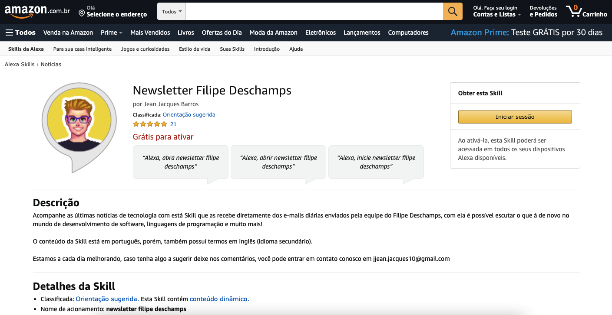
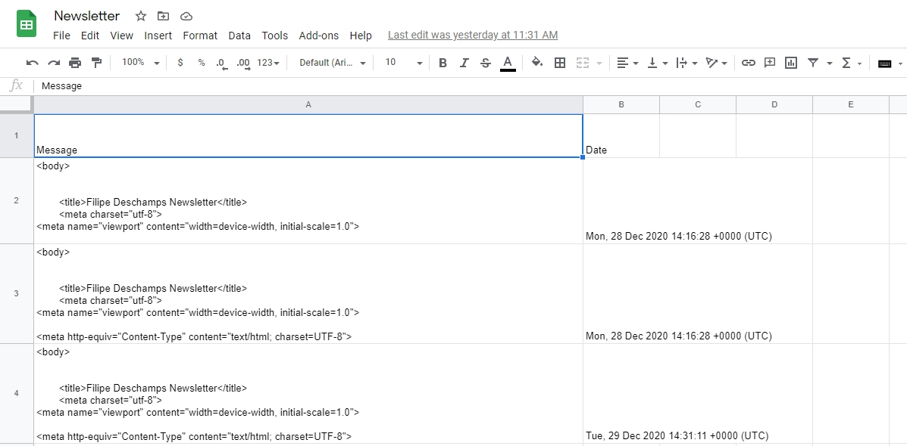

## Alexa - Newsletter Filipe Deschamps

<p align="center">
    
    <br />
    <br />
    <a href="https://www.amazon.com.br/Jean-Jacques-Barros-Newsletter-Deschamps/dp/B08RG61BPD">Ver Demo</a>
    ·
    <a href="https://github.com/jjeanjacques10/alexa-newsletter-deschamps/issues">Reportar Bug</a>
    ·
    <a href="https://github.com/jjeanjacques10/alexa-newsletter-deschamps/issues">Solicitar Feature</a>
</p>

## Sobre o projeto

Skill de conversação para Alexa com objetivo de consumir a newsletter do [Filipe Deschamps](https://github.com/filipedeschamps).  

Está Skill consome os dados de um google sheet, onde armazenos as notícias de tecnologias que são enviadas na newsletter por e-mail. Neste repositório temos dois códigos, o primeiro é uma Custom Skill e o segundo é um Flash Briefing. Explico com mais detalhes a frente.

<p align="center">
    
</p>

## Tecnologias

Este projeto foi desenvolvido utilizando:

- [Alexa Developer Console](https://developer.amazon.com/)
- [NodeJS](https://dart.dev/)
- [Zappier](https://zapier.com/)
- [Google Sheets](https://theoephraim.github.io/node-google-spreadsheet)
- [Docker](https://www.docker.com/)
- [AWS S3](https://aws.amazon.com/s3/)

## Custom Skill

A skill customizada realiza a leitura do conteúdo que está no Google Sheets e retorna para o usuário o texto com todas as notícias. O código está na pasta: [custom skill newsletter](./custom%20skill%20newsletter)

- Vantagens: Conseguimos ler todas as notícias.

- Desvantagens: Não é possível separar uma notícia de outra nem configurar de forma fácil para o resumo diário da Alexa.

## Flash Briefing 

É gerado um arquivo JSON que será enviado para o S3 da Amazon e após isso lido pela Alexa para ser apresentado no Flash Briefing (Resumo de notícias) do usuário.

Exemplo JSON:
``` json
[
   {
      "uid": "b89847c0-bd29-4ae6-a983-e1e715811b32",
      "updateDate": "2021-04-20T15:10:03.335Z",
      "titleText": "Notícias que chamaram a nossa atenção nesta terça-feira:",
      "mainText": "Notícias que chamaram a nossa atenção nesta terça-feira: ",
      "redirectionUrl": "https://filipedeschamps.com.br/newsletter"
   },
   {
       ...
   }
]
```

- Vantagens: Conseguimos separar as notícias e adicionar ao resumo diário da Alexa

- Desvantagens: Limite de 5 notícias por vez.

## Rodando o projeto

Adicione suas credenciais no arquivo: `client_secret_example.json`, você pode encontrar estes dados no console do [Google Cloud Platform](console.developers.google.com).

Atualizei o arquivo `.env` com as suas credenciais do Amazon SDK.

Há dois modos de rodar o script para ler as notícias e gerar um JSON que será lido pela Alexa:

#### Docker Compose

> docker-compose -f "docker-compose.yml" up -d --build

#### Docker

> docker build -t docker-newsletter 

> docker run -it --name docker-newsletter docker-newsletter

#### Rodar uma única vez
```
### Para instalar os pacotes

npm install

### Rodar o script

yarn start

ou

npm run start
```

## Contribuindo

Contribuições são o que tornam a comunidade de código aberto um lugar incrível para aprender, inspirar e criar. Quaisquer contribuições que você fizer serão **muito apreciadas**.

1. Fork o projeto _(Botão de Fork no Github)_
```sh
start https://github.com/jjeanjacques10/alexa-newsletter-deschamps
```
2. Criei sua Feature Branch 
```sh
git checkout -b feature/AmazingFeature
```
3. Commit suas alterações
```sh
git commit -m 'Add some AmazingFeature'
```
4. Push para a Branch 
```sh
git push origin feature/AmazingFeature
```
5. Abra um Pull Request _(Botão de Pull Request no Github)_

```sh
start https://github.com/jjeanjacques10/alexa-newsletter-deschamps/pulls
```

## Skills na Loja Amazon

Você pode testar acessando:
- [Custom Skill](https://www.amazon.com.br/Jean-Jacques-Barros-Newsletter-Deschamps/dp/B08RG61BPD)
- [Flash Briefing](https://www.amazon.com.br/Newsletter-Filipe-Deschamps-Flash-Briefing/dp/B08SQTLJSK)

## Licença

Distribuído sob a licença MIT. Veja [`LICENSE`](./LICENSE) para mais informações.

## Autor

| [<br><sub>@jjeanjacques10</sub>](https://github.com/jjeanjacques10) |
| :---: |